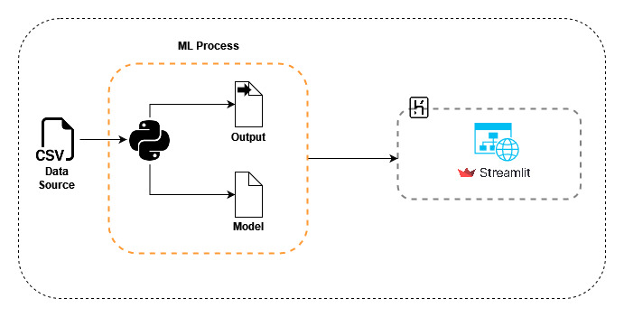

# Customer segmentation model based on credit behavior

## Description :speech_balloon:

Currently, many organizations rely on different data-based methods to segment their market by creating subsets based on demographics, needs, priorities, common interests, and other psychographic or behavioral criteria used to understand better their target audience.

Having said that the main objective of this project is to build a customer segmentation based on credit card payments behavior during the last six months to define marketing strategies.

## Tools :hammer:
​
The tools used to develop the project were:
 * Jupyter Notebook - Python
 * Pandas
 * Numpy
 * scikit-learn
 * Tableau
 * Heroku

## Architecture

The following diagram shows the architecture used in the project, from the data source to the deployment of the website so that users can interact with the application.

 
 

## Project Structure

### Folder structure

* **[app](./app/):** Files needed for the creation of the website with Streamlit and deployed on Heroku.
* **[images](./images/):** Images used in the project
* **[customer_segmentation.ipynb](./customer_segmentation.ipynb):** Main notebook where all the data is read and processed until the trained model is obtained.

 

### Data

The data source was taken from the Kaggle challenge called [Credit Card Dataset for Clustering](https://www.kaggle.com/arjunbhasin2013/ccdata), where you can find the summary of payments behaviors of 9000 credit card active owners during the last six months.

### Analysis

#### Balance

The **Balance** variable presented a mean of **1601.22 USD** with a standard deviation of **2095.57 USD**. Regarding its distribution, it's clear that it has a bias to the right, as is to be expected when working with financial data with a high number of atypical values.

  

<strong>Graph 1</strong>

 

#### Credit Limit

When it comes to the **CREDIT_LIMIT** variable, it has a mean of **4522.09 USD** and a standard deviation of **3659.24 USD**. Regarding its distribution, it's clear that it has a bias to the right.

  

<strong>Balance</strong>

 

## Annotations :loudspeaker:

This [article](./CUSTOMER%20SEGMENTATION%20MODEL%20BASED%20ON%20CREDIT%20CARDS%20BEHAVIOR.pdf) describes the overall project, methods, main findings, conclusions and recommendations for future work. 

## Authors :black_nib:
* **Carlos Barros** [Github](https://github.com/cbarros7), [LinkdIn](https://www.linkedin.com/in/carlosbarros7/)
